# 🚀 AI Code Companion

AI Code Companion is an advanced AI-powered developer platform that connects with GitHub repositories, understands complete codebases, detects issues, fixes bugs automatically, reviews pull requests, generates tests, analyzes architecture, and helps developers ship production-ready code faster.

It works like an AI pair programmer combining features inspired by GitHub Copilot, Cursor, CodeRabbit, and autonomous coding agents.


---

# ✨ Features

# 📸 Product Screenshots

## 🏠 Dashboard

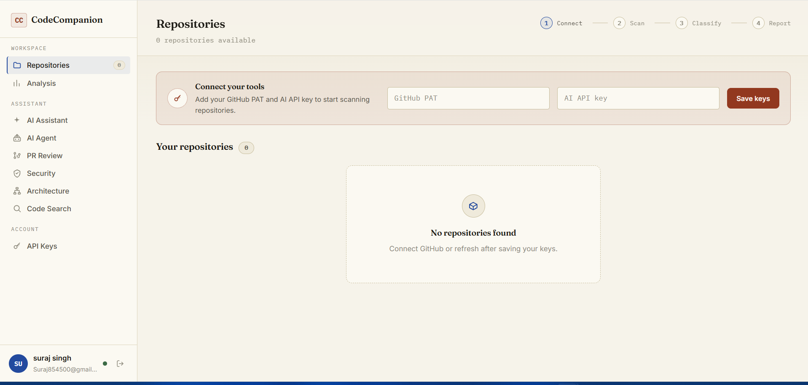

## 🐙 GitHub Repository Integration

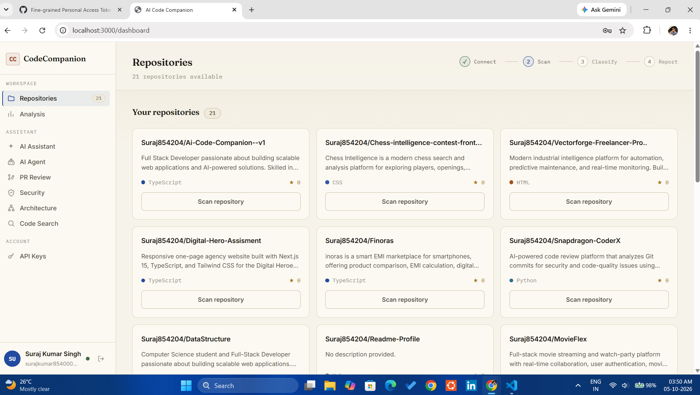

## 🧠 AI Code Analysis

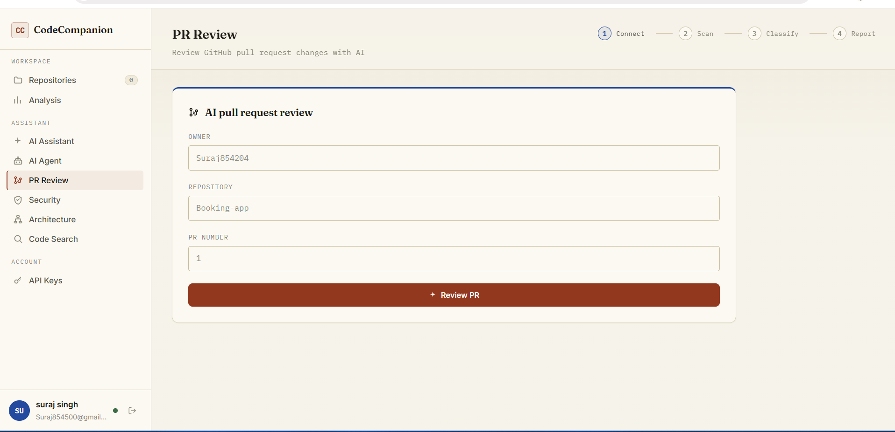

## 🔎 AI Code Search

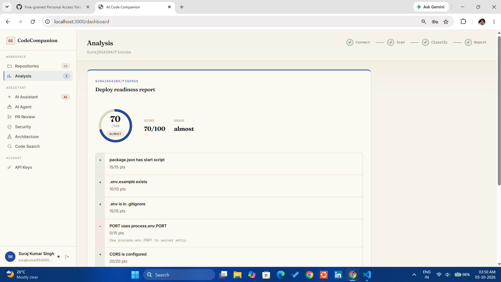

## 🐞 Error Analysis

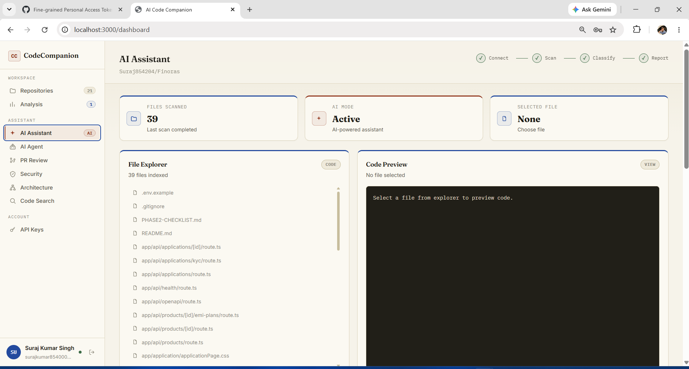

## 🤖 AI Auto Fix

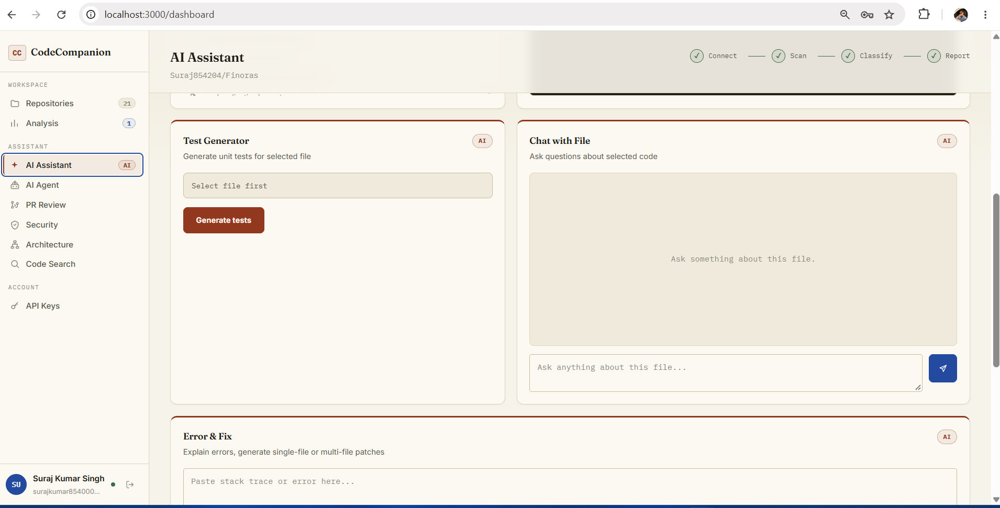

## 🧩 Multi-File Fix

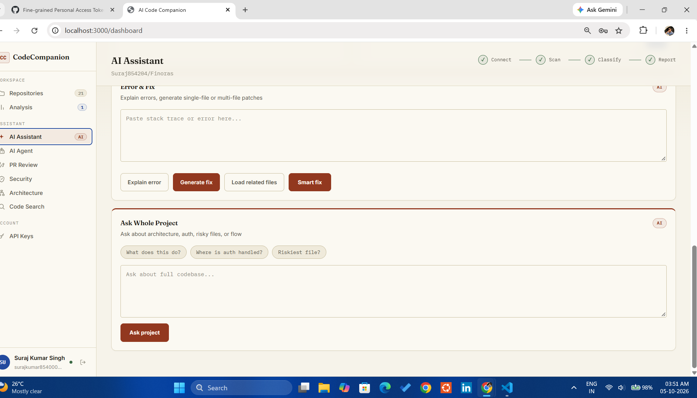

## 🔍 Pull Request Review

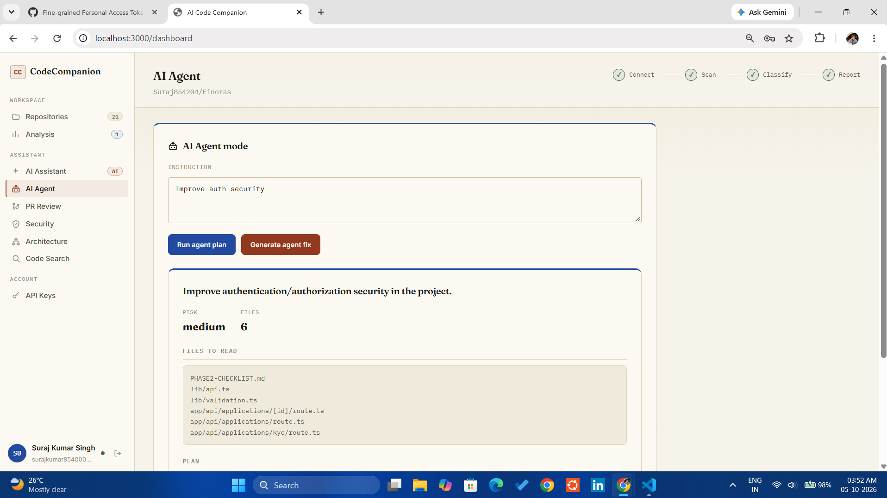

## 🛡️ Security Scanner

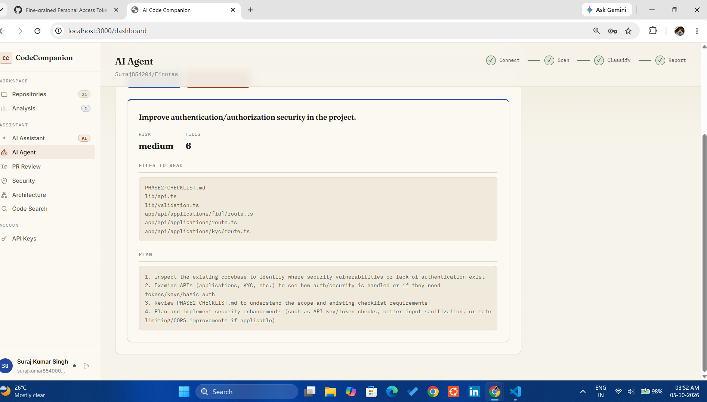

## 🧪 AI Test Generator

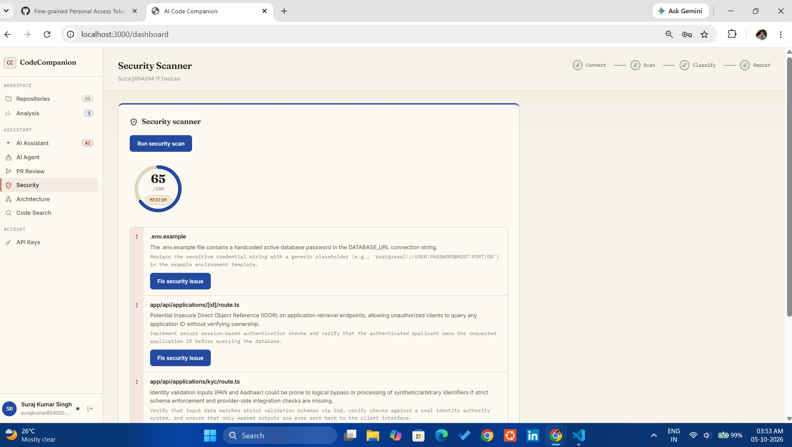

## 🏗️ Architecture Analyzer

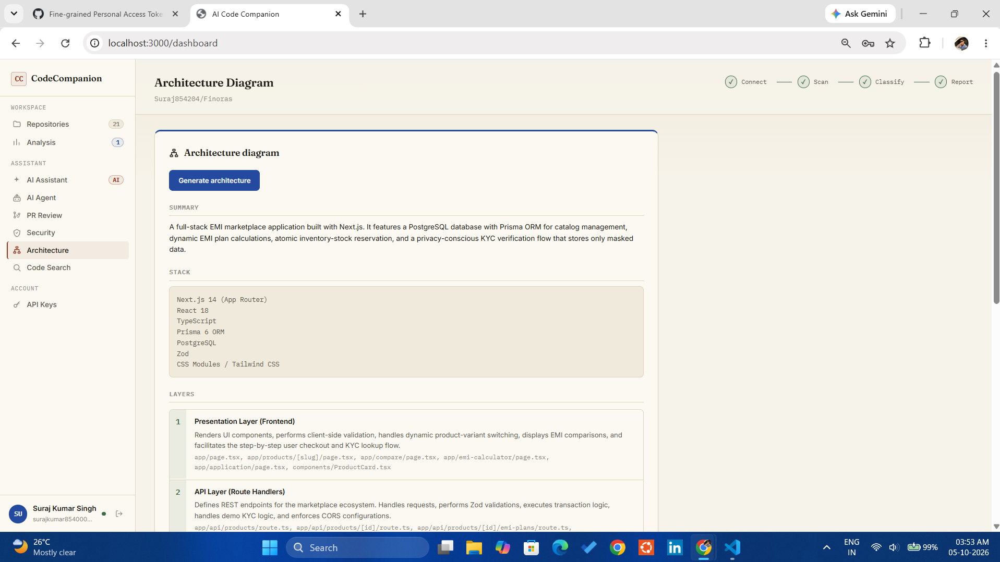

## 🚀 Production Readiness

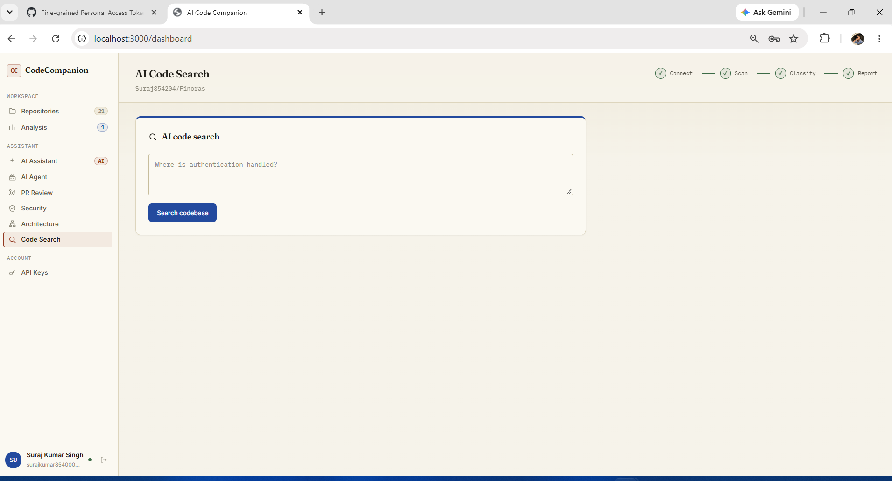

## 🌿 GitHub Pull Request Automation

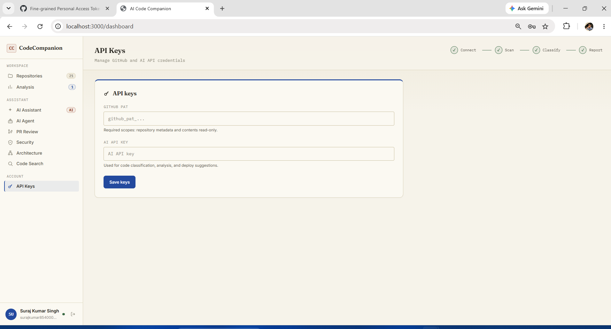


## 🔐 Authentication System

- User signup/login
- JWT authentication
- Protected APIs
- Secure middleware
- User sessions


---

# 🔑 Secure API Key Management

Users can securely connect:

- GitHub Personal Access Token
- Gemini API Key


Security:

- AES-256-GCM encryption
- Tokens encrypted before storing
- User-specific credentials


---

# 🐙 GitHub Integration

Connect GitHub repositories directly.


Features:

✔ Fetch GitHub repositories  
✔ Scan repository files  
✔ Read file contents  
✔ Detect project structure  
✔ Analyze dependencies  


Supported:

- JavaScript
- TypeScript
- Python
- Java
- Node.js
- React
- Next.js
- Express
- Full stack apps


---

# 🧠 AI Code Understanding

Powered by Gemini AI.


## File Chat

Select any file and ask:

Example:

```
Explain this file

Find bugs

Improve this code

Where is authentication handled?
```


AI provides:

- Code explanation
- Logic breakdown
- Suggestions
- Best practices


---

# 🐞 AI Error Solver

Paste any error:

Example:

```
TypeError:
Cannot read property undefined
```

AI returns:

- Root cause
- Line explanation
- Fixed code
- Before/After comparison


---

# 🤖 AI Auto Fix Agent


## Single File Fix

Flow:

```
Select File
      |
Paste Error
      |
Generate Fix
      |
AI updates code
```


Returns:

- Fix summary
- Full corrected file


---

# 🧩 Multi File Smart Fix Agent


Advanced debugging system.


Flow:

```
Error
 |
Related File Finder
 |
AI analyzes:

Controllers
Routes
Models
Views

 |
Fix correct file
```


Example:

If EJS file crashes because controller forgot data:

❌ Wrong:

Fix EJS fallback


✅ Correct:

Fix controller logic


---

# 🌿 AI GitHub Pull Request Creator


AI can directly:

✔ Create new branch  
✔ Commit fixed code  
✔ Push changes  
✔ Open GitHub PR  


Flow:

```
AI Fix
 |
Create Branch

ai-fix-xxxx

 |
Commit
 |
Pull Request
 |
Review
 |
Merge
```


---

# 🔎 AI Pull Request Reviewer


Similar to CodeRabbit.


Analyzes:

- Changed files
- Bugs
- Security risks
- Performance issues
- Code quality


Output:

```
Risk: Medium

Issues:
- File
- Severity
- Explanation
- Fix suggestion
```


---

# 🛠 PR Issue Fix Agent


After AI review:

Click:

```
🤖 Fix This Issue
```


AI:

- Reads review
- Finds correct file
- Fixes issue
- Generates PR-ready patch


---

# 🛡 Security Scanner


Checks:

- Hardcoded secrets
- Unsafe code
- Authentication issues
- Security vulnerabilities


Example:

```
JWT secret exposed

SQL Injection risk

Missing validation
```


---

# 🧪 AI Test Generator


Automatically creates:

- Unit tests
- API tests
- Component tests


Supports:

- Jest
- React Testing Library
- Backend testing


Flow:

```
Select File

↓

Generate Tests

↓

Create Test PR
```


---

# 🏗 Architecture Analyzer


Understands whole repository.


Generates:

- System overview
- Tech stack
- Database flow
- API flow
- Folder explanation


Example:

```
Frontend

↓

API Gateway

↓

Services

↓

Database
```


---

# 🔍 AI Code Search


Ask questions:

```
Where is login handled?

Where is database connected?

Where JWT created?
```


AI finds:

- File
- Function
- Explanation


---

# 🚀 Deploy Readiness Checker


Checks production readiness.


Score:

```
85 / 100

READY
```


Checks:

✔ Start scripts  
✔ Environment variables  
✔ Docker  
✔ README  
✔ CORS  
✔ PORT configs  


Creates shareable reports:

Example:

```
/report/token
```


---

# 🧠 Tech Stack


## Frontend

- Next.js
- TypeScript
- React
- CSS Modules
- Premium Dashboard UI


## Backend

- Node.js
- Express.js
- TypeScript


## Database

- PostgreSQL
- Prisma ORM


## AI

- Google Gemini AI


## DevOps

- Docker
- API Gateway
- Microservices


---

# 🏛 Architecture


```
                 User

                  |

              Next.js UI

                  |

            API Gateway

                  |

--------------------------------

Auth Service

GitHub Service

Scanner Service

AI Service

Report Service

--------------------------------

                  |

             PostgreSQL

                  |

              Gemini AI

                  |

             GitHub API

```


---

# 📂 Project Structure


```
AI-Code-Companion

│

├── frontend

│   ├── app

│   ├── components

│   └── lib/api.ts


├── services


│── auth-service

│── github-service

│── scanner-service

│── ai-service

│── report-service


├── packages

│── database


├── docker-compose.yml

└── README.md

```


---

# ⚙️ Environment Variables


Frontend:


```
NEXT_PUBLIC_API_URL=
```


Backend:


```
DATABASE_URL=

JWT_SECRET=

ENCRYPT_KEY=

GEMINI_MODEL=

FRONTEND_URL=
```


---

# ▶️ Run Locally


Clone repository:


```bash
git clone your-repo-url
```


Install:


```bash
npm install
```


Database:


```bash
npx prisma generate

npx prisma migrate dev
```


Start:


```bash
npm run dev
```


---

# 🌍 Deployment


Recommended:


Frontend:

```
Vercel
```


Backend:

```
Render
```


Database:

```
Neon PostgreSQL
```


---

# 📌 Future Improvements


- GitHub OAuth App
- VS Code extension
- Monaco Editor
- AI terminal agent
- Real-time collaboration
- Voice coding assistant


---

# 👨‍💻 Author


Built by Suraj Kumar Singh


AI-powered developer automation platform.

```
AI + GitHub + Automation
```

⭐ If you like this project, give it a star.
